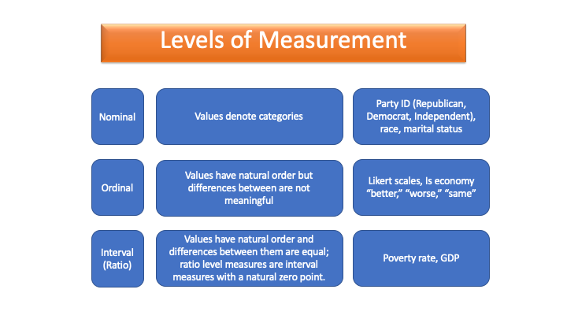

```{r setup, include=FALSE}
library(flexdashboard)
library(rio)
library(ggthemes)
load("SCNominees.RData")
load("counties.RData")
df <- import("cabinet-turnover.csv")
df$length <- as.numeric(df$length) #length was imported as a character vector, changes to numeric

```

### **Levels of Measurement:** Regardless of the analysis you want to conduct with your data, the first question to answer is what is the level of measurement of my variable(s)




**** 

-	Nominal: Variables that do not have any qualitative values. “Labels”
  -	Examples: Gender (Male/Female/Other), Political Party (Republican/Democrat/Independent/Other)
-	Ordinal: Take values with a natural order or rank, but the differences between those ranks aren’t equal: 
  -	Examples: Levels of Education (High School/College/PhD), T-Shirt Size (Small/Medium/Large)
-	Interval: Takes values that have a natural order and differences between the values are equal: “Scale”: 
  -	Examples: Unemployment Rate (percentage of the population), Vote Share (percentage of the population)


### **Summary Statistics:** How you summarize the main features of a variable depends on the level of measurement

<style>
.hl-table-cell td:hover { /* th:hover also if you wish */
  background: LightCyan;
  border: 1px solid #cccccc;
}
</style>

<div class="ox-hugo-table hl-table-cell sane-table">
<div></div>
<div class="table-caption">
  <span class="table-number">**Summary Statistics**</span>
</div>

****

|                                                                                                                                                                                                                                                                                         |                                                                       |                                                                                                             |
|-------------------------------------------------------------------------------------------------------------------------------------------------------------------------------------------|-----------------------------------------------------------------------|-------------------------------------------------------------------------------------------------------------|
|                                                                                                                                         <span style="color:blue">Nominal</span>                                                                                                                                         |                                <span style="color:blue">Ordinal</span>                                |                                                  <span style="color:blue">Interval</span>                                                   |
| Central Tendency:<br>Mode <br> <br>                                                                                                                                                                                                                                                     | Central Tendency:<br>Mode or Median<br> <br>                          | Central Tendency<br>Mean, Median, Mode<br>*Note: Mode will seldom be useful; median is not influenced by outliers, mean is. *<br> <br>  |
| Dispersion:<br>Create a Frequency Table<br> <br>                                                                                                                                                                                                                                        | Dispersion:<br>Create a Frequency Table<br> <br>                      | Dispersion <br>Range, Interquartile Range, Standard Deviation<br> <br>                                      |
| Shape of the Distribution:<br>Unimodal, Bimodal, Multimodal<br> <br>*Note: Be careful when describing the shape of the distribution of a nominal <br> variable because due to it not being coded numerically, the shape can shift <br>depending on how you code the nominal variables*<br> <br>  | Shape of the Distribution:<br>Unimodal, Bimodal, Multimodal<br> <br>  | Shape of the Distribution<br>Unimodal, Bimodal, Multimodal, symmetric, Normal<br> <br>                      |
| Visualization:<br>Bar Plot                                                                                                                                                                                                                                                              | Visualization:<br>Bar Plot                                            | Visualization: <br>Histogram, Box Plot                                                                      |

***

*** 

**Additional Notes: **

- Central Tendency Functions

  +	Mean: calculates the average value: mean(dataframe$name of variable, na.rm=TRUE)
  +	Median: calculates the value lying at the midpoint of a frequency distribution: median(dataframe$name of variable, na.rm=TRUE)

- Dispersion: 

  +	Range. Calculates smallest ( min[] ) and largest (max[]): range(dataframe$name of variable, na.rm = TRUE)
  + Percentiles. The value of the variables that has a certain % of data points below it: Includes interquartile range: quantile(dataframe$name of variable, na.rm=TRUE, probs=c(insert the percentiles you want))
  + Standard deviation: tell us average spread of values of a variable around the mean value of a variable.  Empirical rule: 68% of data falls between 1 standard deviation of mean, 95% of data falls between 2 standard deviations of the mean, and 98% of data falls between 3 standard deviations of the mean: sd(dataframe$name of variable, na.rm = TRUE)

- Assessing Data Shape 

  +	Symmetric distribution: the left side of the distribution mirrors the right side
  + Left skewed: all the data is concentrated on the RIGHT of the graph: looks like a shoe coming down on the left side. 
  +	Right skewed: all the data is concentrated on the LEFT of the graph: looks like a shoe coming down on the right side. 

***


### **Frequency tables:** Present the number (and proportion) of cases in a data frame for each value of a categorical variable

```{r, include = FALSE, echo = FALSE}
library(dplyr)
```
```{r}
knitr::kable(nominees %>%
  group_by(Result) %>%
  summarise(freq = n()) %>%
  mutate(prop = freq / sum(freq))
# The overwhelming majority (119 of the 163 or 73%) of nominees to the US Supreme Court are confirmed; 12 or 7.4% were withdrawn or rejected; 10 (6.1%) were not acted upon; 7 (of 4.3%) of nominations were delayed and 3 (just under 2%) were postponed
)
```


***
```{r, eval = FALSE, echo = TRUE}
library(dplyr)
name of data frame %>%
group_by (name of nominal variable) %>%
summarize (freq = n()) %>%
mutate (prop = freq/sum(freq))

```


### **Bar plots:** Illustrate the central tendency, dispersion, and distribution of a categorical variable 


```{r, message = FALSE, warning = FALSE}
library(plotly)
p <- ggplot(data = nominees, mapping = aes(x = Result)) +
  geom_bar(fill = "red") +
  labs(title = "Nearly All Nominations to the United States Supreme Court Are Confirmed",
       x = NULL,
       y = "Frequency",
       caption = "www.senate.gov") +
  scale_x_discrete(labels = c("Confirmed", "Delayed", "No Action", "Postponed", "Rejected", "Withdrawn"))

library(plotly)
q <- ggplot(data = nominees, mapping = aes(x = Result)) +
  geom_bar(aes(y = ..prop.., group = 1), fill = "red") +
  labs(title = "Nearly All Nominations to the United States Supreme Court Are Confirmed",
       x = NULL,
       y = "Proportion",
       caption = "www.senate.gov") +
  scale_x_discrete(labels = c("Confirmed", "Delayed", "No Action", "Postponed", "Rejected", "Withdrawn"))
library(gridExtra)
grid.arrange(p,q, nrow = 2)
```

***

**Creating a bar plot of frequencies**

```{r, message = FALSE, warning = FALSE, eval = FALSE, echo = TRUE}
library(ggplot2)
ggplot(data = name of data frame, mapping = aes(x = factor(nominal variable name))) +
   geom_bar() + 
   labs(title = “Whatever You Want”, x = “Explanatory Variable Name”,
   y = “Frequency”,
   caption = “Source of data”) +
  scale_x_discrete(labels = c("Label Category 1", "Label Category 2", etc))

```

Note: If you have a factor class variable, you don't need to use the `factor()` function when providing the x aesthetic. If it is labeled, you won't need `scale_x_discrete()`.

**Creating a bar plot of proportions**

```{r, message = FALSE, warning = FALSE, eval = FALSE, echo = TRUE}
library(ggplot2)
ggplot(data = name of data frame, mapping = aes(x = factor(nominal variable name))) +
   geom_bar(es(y = ..prop.., group = 1), fill = "Some Color") + 
   labs(title = “Whatever You Want”, x = “Explanatory Variable Name”,
   y = “Frequency”,
   caption = “Source of data”) +
  scale_x_discrete(labels = c("Label Category 1", "Label Category 2", etc))
```

When plotting proportions of a single variable, set the `group` argument to 1!


### **Histograms:** Illustrate the central tendency, dispersion, and distribution of an interval variable

```{r, include = TRUE, echo = TRUE}
ggplot(data = counties, mapping = aes(x = prop_college_grad)) +
  geom_histogram(fill = "firebrick", bins = 60) +
  geom_vline(aes(xintercept = median(prop_college_grad, na.rm = TRUE)), color = "black", linetype = "dashed") +
         annotate("text", x = .3, y = 250, 
                  label = paste0("Median = ", round(median(counties$prop_college_grad, na.rm = TRUE), digits = 3))) +
  labs(title = "In a Typical County the Proportion of College Graduates is \nabout .185 but the Proportion in Some Counties is Unusually High",
       subtitle = "2016",
       y = "Number of Counties",
       x = NULL,
       caption = "Source: US Census")

```

****

```{r, message = FALSE, warning = FALSE, eval = FALSE, echo = TRUE}
library(ggplot2)
ggplot (data = dataframe, mapping = aes (x = interval variable)) +
geom_histogram (bins = how many bins you want) +
geom_vline (aes(xintercept = mean or median (interval variable, na.rm=TRUE)), color = “the color”, linetype = “dotted/dashed”) + 
annotate(“text”, x = 0.00, y= 1 [labels for where you want to place the annotation lines on the “grid”], 
         label=paste0(“Mean or Median” = round(mean or median(dataframe$interval variable, na.rm=TRUE), 3))) +
labs(title=”Whatever You Want”,
x= NULL, 
y=  “Frequency”, 
caption = “source of data”)
```


### **Box Plots:** illustrate the central tendency, dispersion, and distribution of an interval variable

```{r, include = TRUE, echo = FALSE}
ggplot(data = df, mapping = aes(x = "", y = length)) +
  geom_boxplot(fill = "blue4") + 
  labs(title = "Length of Time in Office of Cabinet Officials (Days) 1980-2018",
       y = "Frequency",
       x = NULL,
       caption = "Source: FiveThirtyEight") +
  theme_igray()
```

***

```{r, message = FALSE, warning = FALSE, eval = FALSE, echo = TRUE}
library(ggplot2) 
ggplot(dataframe, aes(y=outcome variable,)) +
geom_boxplot() +
labs(title= ”Whatever You Want”,
        subtitle= ”Additional Info”, 
        x= NULL, 
        y= NULL, 
        caption= ”Source of Data”)

```


